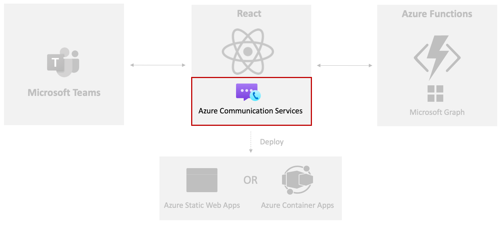
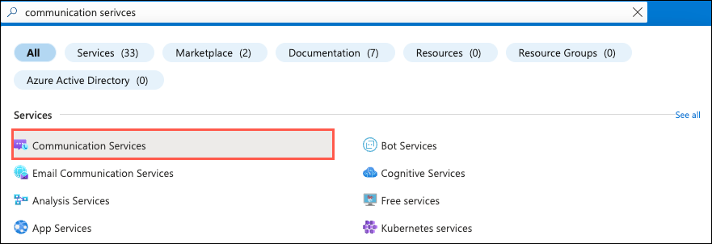
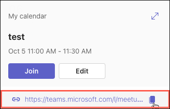
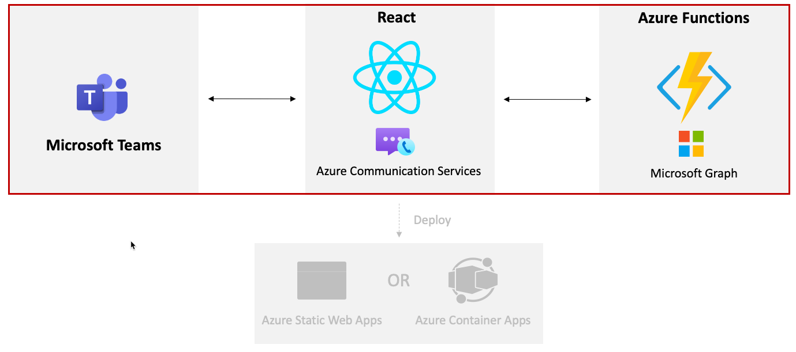
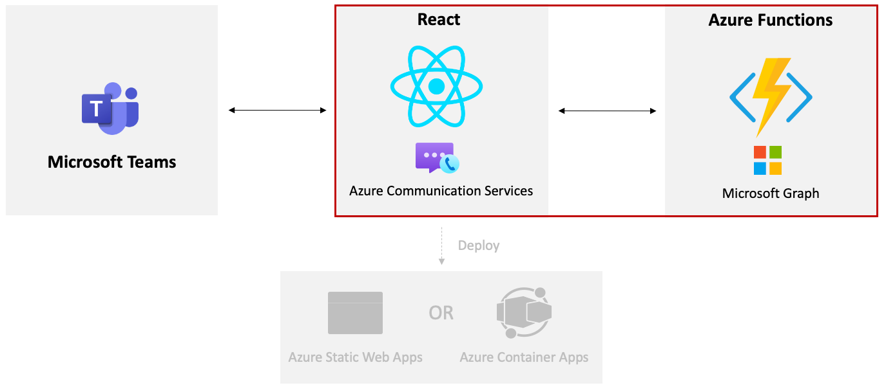
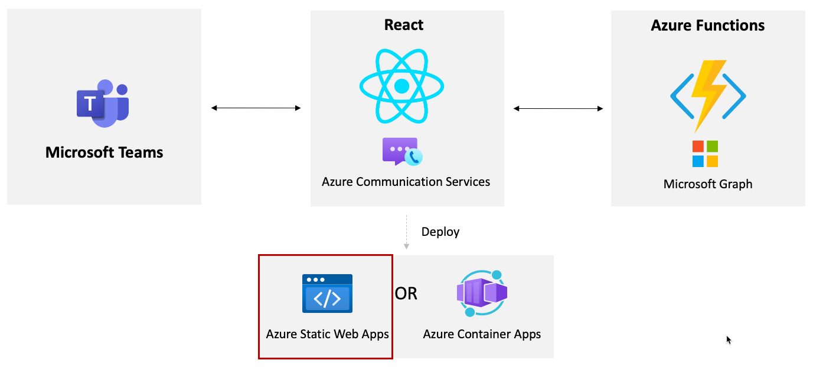
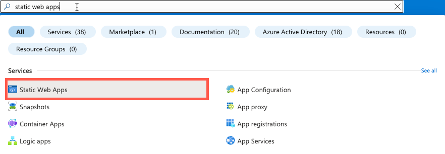

# Tutorial: Audio/Video Calling from a Custom App into a Teams Meeting

In this tutorial you'll learn how Azure Communication Services can be used in a custom React application to allow a user to make an audio/video call into a Microsoft Teams meeting. You'll learn about the different building blocks that can be used to make this scenario possible and be provided with hands-on steps to walk you through the different Microsoft Cloud services involved. 

Here's an overview of the application solution:


### Pre-requisites:
- [Node](https://nodejs.org) - Node 16+ and npm 7+ will be used for this project
- [git](https://learn.microsoft.com/devops/develop/git/install-and-set-up-git)
- [Visual Studio Code](https://code.visualstudio.com/)
- [Azure Functions Extension for VS Code](https://marketplace.visualstudio.com/items?itemName=ms-azuretools.vscode-azurefunctions)
- [Azure subscription](https://azure.microsoft.com/free/search)
- [Microsoft 365 developer tenant](https://developer.microsoft.com/microsoft-365/dev-program)

### Technologies used in this tutorial include:
- React
- Azure Communication Services
- Azure Functions
- Microsoft Graph
- Microsoft Teams

## Exercise 1: Create an Azure Communication Services Resource using the Azure Portal

In this exercise you'll create an Azure Communication Services (ACS) resource in the Azure Portal.



1. Visit https://portal.azure.com in your browser and sign in.

1. Type `communication services` in the top search bar and select `Communication Services` from the options that appear.

    

1. Select `Create` in the toolbar.

1. Perform the following tasks:
    - Select your Azure subscription.
    - Select the resource group to use (create a new one if one doesn't exist).
    - Enter an ACS resource name. It must be a unique value.
    - Select a data location.

1. Select `Review + Create` followed by `Create`.

1. Once your ACS resource is created, navigate to it, and select `Settings --> Identities & User Access Tokens`.

1. Select the `Voice and video calling (VOIP)` checkbox.

1. Select `Generate`.

1. Copy the `Identity` and `User Access token` values to a local file. You'll need the values later in this exercise.

    

1. Select `Settings --> Keys` and copy the `Primary key` connection string value to the local file where you copied the user identity and token values.

1. To run the application you'll need a Teams meeting link. Go to https://teams.microsoft.com, sign in with your Microsoft 365 developer tenant, and select the `Calendar` option on the left. 

    > NOTE: If you don't currently have a Microsoft 365 account, you can sign up for the [Microsoft 365 Developer Program](https://developer.microsoft.com/microsoft-365/dev-program) subscription. It's *free* for 90 days and will continually renew as long as you're using it for development activity. If you have a Visual Studio *Enterprise* or *Professional* subscription, both programs include a free Microsoft 365 [developer subscription](https://aka.ms/MyVisualStudioBenefits), active for the life of your Visual Studio subscription.

1. Select a any date/time on the calendar, add a title for the meeting, and select `Save`.

1. Select the new meeting you added in the calendar and copy the Teams meeting link that is displayed into the same file where you stored the ACS user identity, token, and connection string.

    

1. Now that your ACS resource is setup and you have a Teams meeting join link, let's get the React application up and running.

## Exercise 2: Integrate Azure Communication Services Calling into a React App

In this exercise you'll add the [ACS UI calling composite](https://azure.github.io/communication-ui-library/?path=/docs/composites-call-joinexistingcall--join-existing-call) into a React app to enable making audio/video calls from a custom app into a Microsoft Teams meeting.


1. Visit https://github.com and sign in. If you don't already have a GitHub account, you can select the `Sign up` option to create one.

1. Visit https://github.com/microsoft/MicrosoftCloud.

1. Select the `Fork` option to add the repository to your desired GitHub organization/account.

    

1. Run the following command to clone this repository to your machine. Replace `<YOUR_ORG_NAME>` with your GitHub organization/account name.

    ```bash
    git clone https://github.com/<YOUR_ORG_NAME>/MicrosoftCloud
    ```

1. Open the `samples/acs-video-to-teams-meeting/client/react` project folder in Visual Studio Code. 

1. Open the `package.json` file in VS Code and note the following ACS packages are included:

    ```
    @azure/communication-common 
    @azure/communication-react
    ``` 

1. Double-check that you have `npm 7` or higher installed by opening a terminal window and running the following command:

    ```
    npm --version
    ```

    > NOTE: If you don't have `npm 7` or higher installed you can update npm to the latest version by running `npm install -g npm`.

1. Open a terminal window and run the `npm install` command in the `react` folder to install the application dependencies. 

1. Open `App.tsx` and take a moment to expore the imports at the top of the file. These handle importing ACS security and audio/video calling symbols that will be used in the app.

    ```typescript
    import { 
        AzureCommunicationTokenCredential,
        CommunicationUserIdentifier 
    } from '@azure/communication-common';
    import {  
      CallComposite, 
      fromFlatCommunicationIdentifier, 
      useAzureCommunicationCallAdapter 
    } from '@azure/communication-react';
    import React, { useState, useMemo, useEffect } from 'react';
    import './App.css';
    ```

    > NOTE: You'll see how the `CallComposite` component is used later in this exercise. It provides the core UI functionality for Azure Communication Services to enable making an audio/video call from the app into a Microsoft Teams meeting.

1. Locate the `App` component and perform the following tasks:
    - Take a moment to examine the `useState` definitions in the component.
    - Replace the `userId` `useState` function's empty quotes with the ACS user identity value you copied in the previous exercise.
    - Replace the `token` `useState` function's empty quotes with the ACS token value you copied in the previous exercise.
    - Replace the `teamsMeetingLink` `useState` function's empty quotes with the Teams meeting link value you copied in the previous exercise.

    ```typescript
    // Replace '' with the ACS user identity value
    const [userId, setUserId] = useState<string>('');

    // Replace '' with the ACS token value
    const [token, setToken] = useState<string>('');

    // Replace '' with the Teams meeting link value
    const [teamsMeetingLink, setTeamsMeetingLink] = useState<string>('');
    ```

    > NOTE: Later in this tutorial you'll see how to retrieve the `userId`, `token`, and `teamsMeetingLink` values dynamically.

1. Take a moment to explore the `useMemo` functions in the `App` component.
    - The `credential` `useMemo` function creates a new `AzureCommunicationTokenCredential` instance once the token has a value.
    - The `callAdapterArgs` `useMemo` function returns an object that has the arguments that are used to make an audio/video call. Notice that is uses the `userId`, `credential`, and `teamsMeetingLink` values in the ACS call arguments.

    ```typescript
    const credential = useMemo(() => {
        if (token) {
            return new AzureCommunicationTokenCredential(token)
        }
        return;
    }, [token]);

    const callAdapterArgs = useMemo(() => {
        if (userId && credential && displayName && teamsMeetingLink) {
            return {
                userId: fromFlatCommunicationIdentifier(userId) as CommunicationUserIdentifier,
                displayName,
                credential,
                locator: { meetingLink: teamsMeetingLink },
            }
        }
        return {};
    }, [userId, credential, displayName, teamsMeetingLink]);
    ```

    > NOTE: `useMemo` is used in this scenario because we only want the `AzureCommunicationTokenCredential` object and the call adapter args to be created once as the necessary parameters are passed in. View additional details about [useMemo here](https://reactjs.org/docs/hooks-reference.html#usememo).

1. Once the `credentials` and `callAdapterArgs` are ready, the following line handles creating an ACS call adapter using the `useAzureCommunicationCallAdapter` React hook provided by ACS. The `callAdapter` object will be used later in the UI calling composite component.

    ```typescript
    const callAdapter = useAzureCommunicationCallAdapter(callAdapterArgs);
    ```

    > NOTE: Because `useAzureCommunicationCallAdapter` is a React hook, it won't assign a value to `callAdapter` until the `callAdapterArgs` value is valid.

1. Earlier you assigned the user identity, token, and Teams meeting link to state values in the `App` component. That works fine for now, but in a later exercise you'll see how to dynamically retrieve those values. Since you set the values earlier, comment out the code in the `useEffect` function as shown next. Once you get the Azure Functions running in the next exercises, you'll revisit this code.

    ```typescript
    useEffect(() => {
        /* Commenting out for now
        const init = async () => {
            setMessage('Getting ACS user');
            //Call Azure Function to get the ACS user identity and token
            let res = await fetch(process.env.REACT_APP_ACS_USER_FUNCTION as string);
            let user = await res.json();
            setUserId(user.userId);
            setToken(user.token);

            setMessage('Getting Teams meeting link...');
            //Call Azure Function to get the meeting link
            res = await fetch(process.env.REACT_APP_TEAMS_MEETING_FUNCTION as string);
            let link = await res.text();
            setTeamsMeetingLink(link);
            setMessage('');
            console.log('Teams meeting link', link);
        }
        init();
        */
    }, []);
    ```

1. Locate the following JSX code. It uses the `CallComposite` symbol you saw imported to render the user interface used to make an audio/video call from the React app into a Teams meeting. The `callAdapter` you explored earlier is passed to its `adapter` property to provide the required arguments.

    ```jsx
    if (callAdapter) {
        return (
            <div>
                <h1>Contact Customer Service</h1>
                <div className="wrapper">
                    <CallComposite
                        adapter={callAdapter} 
                    />
                </div>
            </div>
        );
    }
    ```

1. Save the file before continuing.

1. Run `npm start` in your terminal window to run the application. Ensure you run the command within the `react` folder.

1. After the applications builds you should see a calling UI displayed. Enable selecting your microphone and camera and initiate the call. You should see that you're placed in a waiting room. If you join the meeting you setup earlier in Microsoft Teams, you can allow the guest to enter the meeting.

1. Press `ctrl+c` to stop the application. Now that you've successfully run it, let's explore how you can dynamically get the ACS user identity and token and automatically create a Microsoft Teams meeting and return the join URL using Microsoft Graph.

## Exercise 3: Dynamically Create a Microsoft Teams Meeting using Microsoft Graph
In this exercise, you'll automate the process of creating a Microsoft Teams meeting link and passing to the ACS by using Azure Functions and Microsoft Graph.



1. You'll need to create an Azure Active Directory (AAD) app for Deamon app authentication. In this step, authentication will be handled in the backgroud with `app credentials`, and AAD app will use Application Permissions to make Microsoft Graph API calls. Microsoft Graph will be used to dynamically create a Microsoft Teams meeting and return the Teams meeting URL.

1. Perform the following steps to create an AAD app:
    1. Go to [Azure Portal](https://portal.azure.com) and select `Azure Active Directory`.
    1. Select the `App registration` tab followed by `+ New registration`.
    1. Fill in the new app registration form details as shown below and select `Register`:
        - Name: *ACS Teams Interop App*
        - Supported account types: *Accounts in any organizational directory (Any Azure AD directory - Multitenant) and personal Microsoft accounts (e.g. Skype, Xbox)*
        - Redirect URI: leave this blank
    1. After the app is registered, go to `API permissions` and select `+ Add a permission`.
    1. Select `Microsoft Graph` followed by `Application permissions`.
    1. Select the **Calendars.ReadWrite** permission and then select `Add`.
    1. After adding the permissions, select `Grant admin consent for <your organization name>`.
    1. Go to the `Certificates & secrets` tab, select `+ New client secret`, and then select `Add`. 
    1. Copy the value of the secret into a local file. You'll use the value later in this exercise.
    1. Go to the `Overview` tab and copy the `Application (client) ID` and `Directory (tenant) ID` values into the same local file that you used in the previous step.

1. Open the `samples/acs-video-to-teams-meeting/server/typescript` project folder in Visual Studio Code.

1. Go to the `TeamsMeetingFunction` folder and create a `local.settings.json` file with the following values:

    - Use the values you copied into the local file to update the `TENANT_ID`, `CLIENT_ID` and `CLIENT_SECRET` values.
    - Define `USER_ID` with the user id that you'd like to create a Microsoft Teams Meeting. You can get this value by going to [to be added].
    ```json
    {
        "IsEncrypted": false,
        "Values": {
            "FUNCTIONS_WORKER_RUNTIME": "node",
            "TENANT_ID": "",
            "CLIENT_ID": "",
            "CLIENT_SECRET": "",
            "USER_ID": "",
            "ACS_CONNECTION_STRING": ""
        },
        "Host": {
            "LocalHttpPort": 7071,
            "CORS": "*",
            "CORSCredentials": false
        },
        "watchDirectories": [
            "Shared"
        ]
    }
    ```
    >NOTE: `ACS_CONNECTION_STRING` will be used in the next exercise so you don't need to update it yet.

1. Open the `package.json` file in VS Code and note that the following Microsoft Graph and Identity packages are included:

    ```bash
    @azure/communication-identity
    @azure/identity
    @microsoft/microsoft-graph-client
    ```
1. Open a terminal window in the `typescript` folder and run the `npm install` command to install the application dependencies.

1. Open `Shared/graph.ts` and take a moment to expore the imports at the top of the file. This code handles importing authentication and client symbols that will be used in the Azure Function to call Microsoft Graph.

    ```typescipt
    import {startDateTimeAsync, endDateTimeAsync} from './dateTimeFormat';
    import {ClientSecretCredential} from '@azure/identity';
    import {Client} from '@microsoft/microsoft-graph-client';
    import {TokenCredentialAuthenticationProvider} from '@microsoft/microsoft-graph-client/authProviders/azureTokenCredentials';
    import 'isomorphic-fetch';
    ```
    >NOTE: You'll also see imports from `dateTimeFormat.ts` which will be used later in this exercise. `startDateTimeAsync` and `endDateTimeAsync` will be used while creating a Microsoft Teams meeting link to define start date and end date for the meeting. 

1. Take a moment to examine `clientSecretCredential` and `appGraphClient`, they will be used later in the authentication process and when calling the Microsoft Graph API:

    ```typescript
    let clientSecretCredential;
    let appGraphClient;
    ```

1. Locate the `ensureGraphForAppOnlyAuth` function:
    - `ClientSecretCredential` uses the `Tenant Id`, `Client Id` and `Client Secret` values from the Azure Active Directory app.
    - The `authProvider` object is defined as an Azure Active Directory app that will authenticate in the background and use app-only permissions (such as **Calendars.ReadWrite**) to make Microsoft Graph API calls.

    ```typescript
    function ensureGraphForAppOnlyAuth() {
        if (!clientSecretCredential) {
            clientSecretCredential = new ClientSecretCredential(
                process.env.TENANT_ID,
                process.env.CLIENT_ID,
                process.env.CLIENT_SECRET
            );
        }

        if (!appGraphClient) {
            const authProvider = new TokenCredentialAuthenticationProvider(
            clientSecretCredential, {
                scopes: [ 'https://graph.microsoft.com/.default' ]
            });

            appGraphClient = Client.initWithMiddleware({
                authProvider: authProvider
            });
        }
    }
    ``` 

1. Take a moment to explore the `createNewMeetingAsync` function. It posts data to the [Microsoft Graph Calendar Events API](https://learn.microsoft.com/graph/api/calendar-post-events?view=graph-rest-1.0&tabs=http) which dynamically creates an event in a user's calendar and returns the new event details:

    ```typescript
    async function createNewMeetingAsync(userId) {
        ensureGraphForAppOnlyAuth();
        let startTime = await startDateTimeAsync();
        let endTime = await endDateTimeAsync();
        const newMeeting = `/users/${userId}/calendar/events`;
        
        const event = {
        subject: 'Customer Service Meeting',
        start: {
            dateTime: startTime,
            timeZone: 'UTC'
        },
        end: {
            dateTime: endTime,
            timeZone: 'UTC'
        },
        isOnlineMeeting: true
        };
        
        const newEvent = await appGraphClient.api(newMeeting).post(event);    
        return newEvent;     
    }

    export default createNewMeetingAsync;
    ```

1. Go to `TeamsMeetingFunction/index.ts` and explore the Http Trigger function:
    - `createNewMeetingAsync` is imported from `graph.ts`. It handles creating and retrieving new event details.
    - `userId` is retrieved from `local.settings.json` inside the Http Trigger function. This is done by accessing the `USER_ID` environment variable by using `process.env.USER_ID`.
    - When the function is triggered, it calls `createNewMeetingAsync` with the defined user id and returns the new event details in `teamMeetingLink` parameter.
    - The function accesses the Teams meeting join URL by calling `meeting.onlineMeeting.joinUrl` and returns the value in the body of the response.

    ```typescript
    import { AzureFunction, Context, HttpRequest } from "@azure/functions";
    import createNewMeetingAsync from '../Shared/graph';

    let teamsMeetingLink;

    const httpTrigger: AzureFunction = async function (context: Context, req: HttpRequest){
        context.log("Request received");
        const userId = process.env.USER_ID;
        context.log('UserId', userId);
        
        teamsMeetingLink = await createNewMeetingAsync(userId);
        const body = JSON.stringify(teamsMeetingLink);
        const meeting = JSON.parse(body);
        context.log("meeting:", meeting);
        
        context.res = {
            // status: 200, /* Defaults to 200 */
            body: meeting.onlineMeeting.joinUrl
        }    
    };

    export default httpTrigger;
    ```

1. Use a terminal window to run `npm start` in the `samples/acs-video-to-teams-meeting/server/typescript` folder to run the function locally. 

1. Now that the `TeamsMeetingFunction` is ready to use, let's call the function from the React app.

1. Go back to the `samples/acs-to-teams-meeting/client/react` folder in VS Code. Add a `.env` file into the folder with the following values:

    ```
    REACT_APP_TEAMS_MEETING_FUNCTION=http://localhost:7071/api/TeamsMeetingFunction

    REACT_APP_ACS_USER_FUNCTION=http://localhost:7071/api/ACSTokenFunction
    ```

    > NOTE: These values will be passed into React as it builds so that you can easily change them as needed during the build process.

1. Open `samples/acs-to-teams-meeting/client/react/App.tsx` file in VS Code.

1. Locate the `teamsMeetingLink` state variable in the component. Remove the hardcoded teams link and replace it with empty quotes:

    ```typescript
    const [teamsMeetingLink, setTeamsMeetingLink] = useState<string>('');
    ```

1. Locate the `useEffect` function and change it to look like the following. This handles calling the Azure Function you looked at earlier which creates a Teams meeting and returns the meeting join link:

    ```typescript
    useEffect(() => {
        const init = async () => {
            /* Commenting out for now
            setMessage('Getting ACS user');
            //Call Azure Function to get the ACS user identity and token
            let res = await fetch(process.env.REACT_APP_ACS_USER_FUNCTION as string);
            let user = await res.json();
            setUserId(user.userId);
            setToken(user.token);
            */
            
            setMessage('Getting Teams meeting link...');
            //Call Azure Function to get the meeting link
            res = await fetch(process.env.REACT_APP_TEAMS_MEETING_FUNCTION as string);
            let link = await res.text();
            setTeamsMeetingLink(link);
            setMessage('');
            console.log('Teams meeting link', link);

        }
        init();

    }, []);
    ```

1. Save the file before continuing.

1. Open another terminal window, `cd` into the `react` folder, and run `npm start` to build and run the application. 

1. After the application builds, you should see the ACS calling UI displayed and can then call into the Teams meeting that was dynamically created by Microsoft Graph.

1. Stop both of the terminal processes (React and Azure Functions) by entering `ctrl + c` in each terminal window.

## Exercise 4: Dynamically Create an Azure Communication Services Identity and Token

In this exercise you'll learn how to dynamically retrieve user identity and token values from Azure Communication Services using Azure Functions. Once retrieved, the values will be passed to the ACS UI composite to enable a call to be made by a customer.



1. Open `local.settings.json` and update the `ACS_CONNECTION_STRING` value with the ACS connection string you saved in an earlier exercise.

1. Open `samples/acs-to-teams-meeting/server/typescript/ACSTokenFunction/index.ts` in VS Code. 

1. Notice that it has the following import at the top of the file:

    ```typescript
    import { CommunicationIdentityClient } from '@azure/communication-identity';

    ```

1. The function performs the following tasks:
    - Gets the ACS connection string from an environment variable named `ACS_CONNECTION_STRING`.

        ```typescript
        const connectionString = process.env.ACS_CONNECTION_STRING;
        ```

        > NOTE: This is the connection string value you added into the `local.settings.json` file earlier.
    
    - Creates a new `CommunicationIdentityClient` instance and passes the ACS connection string to it.

        ```typescript
        let tokenClient = new CommunicationIdentityClient(connectionString);
        ```

    - Creates an ACS user and gets a Voice Over IP token.

        ```typescript
        const user = await tokenClient.createUser();
        const userToken = await tokenClient.getToken(user, ["voip"]);
        ```

    - Sends the userId and token values back to the caller.

        ```typescript
        context.res = {
            body: { userId: user.communicationUserId, ...userToken }
        };
        ```

1. Go to the `samples/acs-to-teams-meeting/server/typescript` folder in a terminal window and run `npm start`.

1. Now that the Azure Functions are running locally, the client needs to be able to call into them to get the ACS user identity and token values.

1. Open `samples/acs-to-teams-meeting/client/react/App.tsx` file in your editor.

1. Locate the `userId` and `token` state variables in the component. Remove the hardcoded values and replace them with empty quotes:

    ```typescript
    const [userId, setUserId] = useState<string>('');
    const [token, setToken] = useState<string>('');
    ```

1.  Locate the `useEffect` function and change it to look like the following to enable calling the Azure Function to retrieve an ACS user identity and token: 

    ```typescript
    useEffect(() => {
        const init = async () => {
            setMessage('Getting ACS user');
            //Call Azure Function to get the ACS user identity and token
            let res = await fetch(process.env.REACT_APP_ACS_USER_FUNCTION as string);
            let user = await res.json();
            setUserId(user.userId);
            setToken(user.token);
            
            setMessage('Getting Teams meeting link...');
            //Call Azure Function to get the meeting link
            res = await fetch(process.env.REACT_APP_TEAMS_MEETING_FUNCTION as string);
            let link = await res.text();
            setTeamsMeetingLink(link);
            setMessage('');
            console.log('Teams meeting link', link);
        }
        init();

    }, []);
    ```

1. Save the file before continuing.

1. Open a separate terminal and run `npm start` in the `react` folder. After it builds you should see the ACS calling UI displayed and you can call into the Teams meeting that was dynamically created by Microsoft Graph.

1. Stop both of the terminal processes (React and Azure Functions) by selecting `ctrl + c`.

1. Commit your git changes and push them to your GitHub repository using VS Code:
    - Select the git icon (3rd one down in the VS Code toolbar).
    - Enter a commit message and select `Commit`.
    - Select `Sync Changes`.

## Exercise 5: Publish the App to Azure Static Web Apps

In this exercise you'll learn how to publish the ACS React app and the Azure Functions to the cloud using Azure Static Web Apps.



1. Visit https://portal.azure.com in your browser and sign in.

1. Type `static web apps` in the top search bar and select `Static Web Apps` from the options that appear.

    

1. Select `Create` in the toolbar.

1. Perform the following tasks:
    - Select your subscription.
    - Select the resource group to use (create a new one if needed).
    - Enter an Azure Static Web Apps name of `acs-to-teams-meeting`.
    - Select the `Free` plan type.
    - Select a region.

1. Select the GitHub radio button and sign in to your GitHub account.

1. After signing in, select your GitHub:
    - Organization
    - Repository (this will be the `MicrosoftCloud` repository you forked)
    - Branch (select `main`)

1. In the `Build Details` section perform the following tasks:
    - Build Presets: `React`
    - App location: `/samples/acs-to-teams-meeting/client/react`
    - Api location: `/samples/acs-to-teams-meeting/server/typescript`
    - Output location: `build`

1. Select `Review + create`.

1. Review the details and select `Create`.

1. Notice the URL that is created for your static web app. Copy the URL shown on the Overview screen to a file. You'll need it later in this exercise.

1. Select `Settings --> Configuration` for your new static web app.

1. Add all of the following key/value pairs into the `Application settings` by selecting the `+ Add` button. Get the values from your `local.settings.json` in the `server/typescript` folder.

    ```
    # Get the values from your local.settings.json file
    TENANT_ID: <YOUR_VALUE>
    CLIENT_ID: <YOUR_VALUE>
    CLIENT_SECRET: <YOUR_VALUE>
    USER_ID: <YOUR_VALUE>
    ACS_CONNECTION_STRING: <YOUR_VALUE>
    ```

1. Select the `Save` button at the top of the Configuration screen in the Azure Portal.

1. Now that you've finished setting up the Azure Static Web App, go back to your GitHub repository (the one you forked earlier) and notice a `.yml` file has been added into the `.github/workflows` folder. 

1. Open the `.yml` file in VS Code and add the following YAML immediately after the `###### End of Repository/Build Configurations ######` comment. Replace the `<YOUR_AZURE_SWA_DOMAIN>` placeholders with your Azure Static Web Apps URL value. 

    > IMPORTANT: Ensure that the `env:` property is indented properly. It should match up with the indentation of the `with:` property above it.

    ```yaml
    env: # Add environment variables here
        REACT_APP_ACS_USER_FUNCTION: https://<YOUR_AZURE_SWA_DOMAIN>/api/ACSTokenFunction
        REACT_APP_TEAMS_MEETING_FUNCTION: https://<YOUR_AZURE_SWA_DOMAIN>/api/TeamsMeetingFunction
    ```

    > NOTE: This will add environment variables into the build process for the React app so that it knows what APIs to call to get the ACS user token as well as to create a Teams meeting.

1. Save the `.yml` file and push the changes up to your GitHub repository. This will trigger a new build of the React application to occur as well as a new deployment to your Azure Static Web App. 

1. Once the build process completes, visit the URL for your Azure Static Web App and you should see the application running.

1. You've successfully completed this tutorial!


